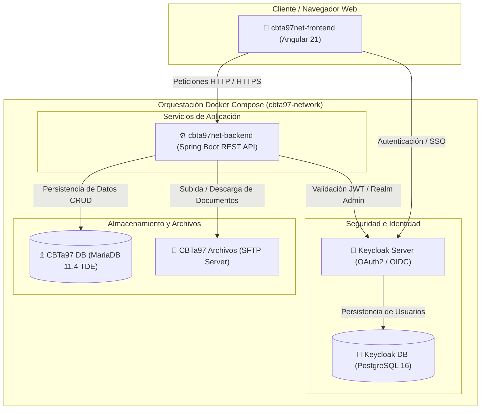

# 🏫 CBTa 97 Net — Sistema de Gestión Académica y Administrativa

**CBTa 97 Net** es una plataforma web integral diseñada para la automatización, digitalización y optimización de los procesos académicos y administrativos del **Centro de Bachillerato Tecnológico Agropecuario (CBTA) No. 97**.

El sistema proporciona un entorno seguro, escalable y centralizado para la administración de alumnos, grupos, calificaciones, expediente escolar y control de acceso basado en roles (RBAC).

---

## Visión General del Proyecto

La plataforma está concebida bajo una arquitectura orientada a servicios desacoplados, garantizando alta disponibilidad, seguridad de la información mediante cifrado en reposo y gestión centralizada de identidades.



---

## Componentes Principales del Sistema

El proyecto consta de dos componentes de software principales que concentran la lógica de negocio y la experiencia de usuario:

### 1. ⚙️ `cbta97net-backend`
Es el núcleo de procesamiento y API RESTful del sistema, desarrollado con **Java 21** y **Spring Boot 3.5+**.

* **Responsabilidades Clave:**
  * Procesamiento de reglas de negocio académicas (gestión de grupos, inscripciones, materias y calificaciones).
  * Exposición de endpoints RESTful seguros para consumo por parte de la interfaz cliente.
  * Integración con **Keycloak** mediante *Spring Security OAuth2 Resource Server* para la validación de tokens JWT y control de acceso basado en roles.
  * Comunicación con la base de datos principal MariaDB aplicando restricciones estrictas de permisos CRUD.
  * Gestión centralizada y transferencia segura de archivos académicos (expedientes, certificados, fotos) mediante protocolo **SFTP** (*Spring Integration SFTP*).
  * Generación y lectura masiva de reportes y plantillas académicas en formato Excel mediante **Apache POI**.

### 2. 📱 `cbta97net-frontend`
Es la interfaz de usuario moderna, reactiva y adaptable, construida con **Angular 21** y estilizada con **Tailwind CSS v4**.

* **Responsabilidades Clave:**
  * Presentación visual intuitiva y dinámica para alumnos, docentes y personal administrativo.
  * Autenticación de usuarios mediante flujo OAuth2 / OpenID Connect (OIDC) integrado con Keycloak.
  * Consumo reactivo de los servicios RESTful del backend mediante HTTP Clients y gestión de estado.
  * Módulos para captura de calificaciones, consulta de kárdex, administración de plantilla docente, control de grupos y carga de expedientes académicos.

---

## 🐳 Definición de Docker Compose

El entorno de ejecución del proyecto está completamente contenerizado mediante **Docker Compose**, lo que garantiza un despliegue homogéneo y reproducible tanto en desarrollo como en producción.

El sistema se orquesta a través de los archivos `docker-compose.yml` (desarrollo) y `docker-compose.prod.yml` (producción), los cuales definen los siguientes servicios integrados en la red interna `cbta97-network`:

| Servicio en Compose | Nombre del Contenedor | Imagen / Contexto | Descripción y Función | Puerto Expuesto |
| :--- | :--- | :--- | :--- | :--- |
| **`cbta97-api`** | `cbta97-api-v2` / `cbta97-api` | `./cbta97net-backend` | Servidor de aplicación Spring Boot que contiene la API REST de `cbta97net-backend`. | `8080:8080` |
| **`keycloak`** | `keycloak-server-v1` / `keycloak-server` | `quay.io/keycloak/keycloak:26.4.7` | Servidor de Autenticación y Autorización (SSO, OAuth2, OIDC). Importa automáticamente el Realm de producción `cbta97-realm-prod.json`. | `9090:9090` |
| **`keycloak-db`** | `keycloak-db-v1` / `keycloak-db` | `postgres:16-alpine` | Base de datos PostgreSQL dedicada exclusivamente al almacenamiento de la información de usuarios y sesiones de Keycloak. | Interno |
| **`cbta97-db`** | `cbta97-db-v2` / `cbta97-db` | `mariadb:11.4` | Base de datos relacional del sistema `cbta97net-backend` con **Cifrado de Disco TDE (AES_CTR)** habilitado y scripts automáticos de permisos CRUD. | `3306:3306` |
| **`cbta97-archivos`** | `cbta97-archivos-v1` / `cbta97-archivos` | `atmoz/sftp` | Servidor SFTP para almacenamiento persistente y seguro de documentos cargados por los usuarios. | `2222:22` |

> [!NOTE]
> **Seguridad en MariaDB (TDE & CRUD):** La base de datos `cbta97-db` incluye cifrado transparente de tablas y logs en disco (*Transparent Data Encryption - TDE*) a nivel de motor de almacenamiento InnoDB, garantizando la protección de los datos académicos sensibles.

---

## Variables de Entorno Necesarias

Para que el sistema funcione correctamente, se debe crear un archivo `.env` en la raíz del proyecto. Estas variables son leídas por **Docker Compose** e inyectadas a los contenedores correspondientes.

### Tabla de Variables de Entorno

| Variable | Descripción | Componentes que la utilizan | Valor de Ejemplo / Defecto |
| :--- | :--- | :--- | :--- |
| `KC_ADMIN_PASS` | Contraseña del usuario administrador bootstrap / consola de Keycloak. | `keycloak`, `cbta97-api` | `Cbta97.Admin*2026!` |
| `KC_DB_PASS` | Contraseña del usuario `keycloak` para la base de datos PostgreSQL. | `keycloak`, `keycloak-db` | `Cbta97.PgKey*2026!` |
| `KC_CLIENT_SECRET` | Secret del cliente OAuth2 (`cbta97-client-api-rest`) configurado en Keycloak. | `cbta97-api` | `7CysJjhAFFglRinU4ctplZrDFZJL1dWg` |
| `KC_CONSOLE_PASS` | Contraseña del usuario administrativo del Realm para la consola de gestión de API. | `cbta97-api` | `Cbta97.Console*1904!` |
| `CBTA_API_ROOT_PASS` | Contraseña del usuario `root` de la base de datos MariaDB (`cbta97-db`). | `cbta97-db` | `Cbta97.Root*Secure!` |
| `CBTA_API_PASS` | Contraseña del usuario `cbta97_api_user` con permisos CRUD en MariaDB. | `cbta97-db`, `cbta97-api` | `Cbta97.ApiDb*CRUD$` |
| `CBTA_SFTP_PASS` | Contraseña del usuario `admin_sftp` para el servidor SFTP de archivos. | `cbta97-archivos`, `cbta97-api` | `Cbta97.Sftp*Uploads%` |

### Plantilla de Archivo `.env`

Copia el siguiente contenido en un archivo llamado `.env` en el directorio raíz del proyecto:

```env
# Keycloak Security & DB Configuration
KC_ADMIN_PASS=Cbta97.Admin*2026!
KC_DB_PASS=Cbta97.PgKey*2026!
KC_CLIENT_SECRET=7CysJjhAFFglRinU4ctplZrDFZJL1dWg
KC_CONSOLE_PASS=Cbta97.Console*1904!

# CBTa97 MariaDB Database Configuration
CBTA_API_ROOT_PASS=Cbta97.Root*Secure!
CBTA_API_PASS=Cbta97.ApiDb*CRUD$

# SFTP File Server Configuration
CBTA_SFTP_PASS=Cbta97.Sftp*Uploads%
```

---

## Guía de Inicio Rápido y Despliegue

### Requisitos Previos
* [Docker Desktop](https://www.docker.com/) (con soporte para Docker Compose v2+).
* [Git](https://git-scm.com/).

### Pasos para Ejecutar el Sistema

1. **Clonar el repositorio:**
   ```bash
   git clone <URL_DEL_REPOSITORIO>
   cd cbta97net
   ```

2. **Configurar las variables de entorno:**
   Asegúrate de tener creado el archivo `.env` en la raíz con las credenciales requeridas.

3. **Inicializar configuraciones de infraestructura (TDE y Permisos):**
   Ejecuta el script de inicialización para preparar los archivos de llaves criptográficas y scripts de base de datos:
   * **Windows:**
     ```cmd
     init.bat
     ```

4. **Levantar los contenedores del sistema:**
   * **Modo Desarrollo:**
     ```bash
     docker compose up -d
     ```
   * **Modo Producción:**
     ```bash
     docker compose -f docker-compose.prod.yml up -d
     ```

5. **Verificar el estado del sistema:**
   * **Backend API REST (`cbta97net-backend`):** [http://localhost:8080/api/v1/health](http://localhost:8080/api/v1/health)
   * **Keycloak IAM:** [http://localhost:9090](http://localhost:9090)
   * **Servidor SFTP:** Host `localhost`, puerto `2222`

---

## Licencia

Este proyecto es propiedad del **Centro de Bachillerato Tecnológico Agropecuario No. 97** y está destinado a uso académico y administrativo institucional.
